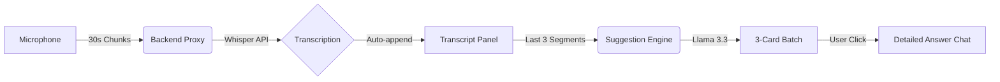

# 🧠 TwinMind Live Suggestions — AI Meeting Copilot

**TwinMind Live** is a state-of-the-art, real-time AI meeting copilot designed to bridge the gap between listening and participating. It listens to live audio, transcribes it instantly, and uses advanced LLMs to provide actionable "Live Suggestions" every 30 seconds.

---

## 🧩 Project Overview
In high-stakes meetings, it's easy to lose track of context or miss opportunities to ask the right questions. **TwinMind** acts as your second brain, continuously analyzing the conversation and pushing "Suggested Batches" of questions, talking points, and next steps to your dashboard without you having to lift a finger.

---

## 🏗️ Tech Stack
- **Frontend**: React (Vite) + Tailwind CSS + Framer Motion (for smooth, premium animations).
- **Backend**: Node.js + Express (Serverless ready for Vercel).
- **AI APIs**: 
  - **Groq Whisper Large V3**: Industry-leading speed for Speech-to-Text.
  - **Groq Llama 3.3 70B**: High-reasoning model for context-aware suggestions and detailed chat.
- **State Management**: React Context API + LocalStorage for persistent configuration.

---

## 🧠 Prompt Engineering Strategy (Core Logic)

The "Brain" of TwinMind relies on three distinct prompt layers designed for maximum utility and minimal noise.

### 1. The "Diversity-First" Suggestion Prompt
To avoid repetitive or vague outputs, the suggestion prompt uses a strict **Type-Enforcement Logic**:
- **Objective**: Generate exactly 3 suggestions.
- **Diversity Constraint**: Each batch must contain 1 **Probing Question** (to uncover depth), 1 **Strategic Insight/Talking Point** (to add value), and 1 **Action Item/Answer** (to drive progress).
- **Context Windowing**: We use a **Sliding Context Window** of the last ~2,000 characters of the transcript. This ensures the AI isn't bogged down by the start of the meeting and focuses on the *current* conversation flow.

### 2. Context-Aware Deep Dives
When a suggestion is clicked, the **Chat Prompt** shifts from "Summarizer" to "Subject Matter Expert." It pulls the **Full Session Transcript** to ensure the detailed answer is technically accurate and grounded in everything discussed so far.

---

## 📐 Architecture & Flow


1.  **Frontend**: Captures audio via `MediaRecorder` API, chunked every 30s to balance latency and context completeness.
2.  **Backend**: Processes chunks in memory (Vercel-compatible) and proxies to Groq. 
3.  **Real-Time Loop**: Auto-triggers new suggestions batches every 30s, fading older batches into the background to keep the UI clean.

---

## ⚖️ Tradeoffs & Optimizations

### 🚀 Latency vs. Accuracy
- **Decision**: We chose **Whisper Large V3** via Groq's LPUs.
- **Tradeoff**: While a local model would be more private, the **sub-second transcription latency** provided by Groq is critical for a "Live" experience where 2-3 seconds of delay can make a suggestion irrelevant.

### 📏 Context Window size
- **Decision**: The suggestion batching uses a **Rolling Window** instead of the full transcript.
- **Tradeoff**: This loses some "long-term memory" in suggestions but ensures **extremely fast response times** and keeps the AI focused on the *immediate* moment, which is where "Live Suggestions" are most valuable.

### ☁️ Serverless Deployment
- **Decision**: Deployment optimized for **Vercel Serverless**.
- **Tradeoff**: Required switching from `DiskStorage` to `MemoryStorage` for audio. While this limits file size to 4.5MB, it's perfect for 30s audio chunks and enables **zero-cost scaling**.

---

## ⚙️ Setup & Installation

### Backend
```bash
cd server
npm install
npm start
```

### Frontend
```bash
cd client
npm install
npm run dev
```

> [!IMPORTANT]
> Ensure you set your `GROQ_API_KEY` in the `server/.env` file or directly in the App Settings panel.

---

## 🎨 UI Aesthetics
- **Dark Mode**: High-contrast, easy-on-the-eyes during long meetings.
- **Glassmorphism**: Premium frosted-glass effect for panels.
- **Micro-interactions**: Pulse animations for recording states and layout transitions.
