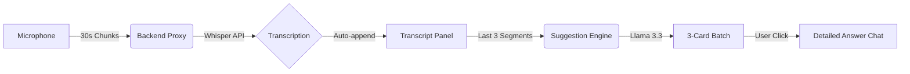

# 🧠 TwinMind Live Suggestions — AI Meeting Copilot

**TwinMind Live** is a state-of-the-art, real-time AI meeting copilot designed to bridge the gap between listening and participating. It listens to live audio, transcribes it instantly, and uses advanced LLMs to provide actionable "Live Suggestions" every 30 seconds.

---

## 🧩 Project Overview
In high-stakes meetings, it's easy to lose track of context or miss opportunities to ask the right questions. **TwinMind** acts as your second brain, continuously analyzing the conversation and pushing "Suggested Batches" of questions, talking points, and next steps to your dashboard without you having to lift a finger.

---

## 📂 Project Structure
```text
TaiAssi/
├── client/             # React (Vite) Frontend
│   ├── src/            # Components, Hooks, Context
│   └── vite.config.js  # Proxy config for local development
├── server/             # Node.js (Express) Backend
│   ├── routes/         # API endpoints (Transcribe, Suggest, Chat)
│   └── index.js        # Main entry point
├── vercel.json         # Deployment configuration for Vercel
└── README.md           # This comprehensive guide
```

---

## 🏗️ Tech Stack
- **Frontend**: React (Vite) + Tailwind CSS + Framer Motion.
- **Backend**: Node.js + Express.
- **AI Engine**: 
  - **Groq Whisper Large V3**: For ultra-fast Speech-to-Text.
  - **Groq Llama 3.3 70B**: For context-aware suggestions and chat reasoning.
- **Deployment**: Vercel (Optimized for Serverless).

---

## 🧠 Prompt Engineering Strategy
The "Brain" uses a three-layer prompt strategy:
1. **Diversity-First Suggestions**: Generates 1 Probing Question, 1 Strategic Insight, and 1 Action Item every 30s.
2. **Sliding Context Window**: Uses only the last 2,000 characters for suggestions to maintain speed and focus.
3. **Session Memory Chat**: A dedicated agent that has access to the *entire* transcript for technical deep dives.

---

## 📐 System Architecture


---

## ⚙️ Local Setup & Installation

### 1. Prerequisites
- Node.js installed.
- A **Groq API Key** (Get it from [console.groq.com](https://console.groq.com)).

### 2. Backend Configuration
```bash
cd server
npm install
```
Create a `.env` file in the `server` folder:
```env
GROQ_API_KEY=your_key_here
PORT=5000
```
Run the server:
```bash
npm start
```

### 3. Frontend Configuration
```bash
cd client
npm install
npm run dev
```
The frontend is configured to proxy `/api` requests to `http://localhost:5000`.

---

## 🚀 Deployment (Vercel)
This project is pre-configured for Vercel. 
1. Push your code to GitHub.
2. Import the project into Vercel.
3. Add `GROQ_API_KEY` to Vercel's **Environment Variables**.
4. Deploy!

---

## 🎨 UI Aesthetics
- **Dark Mode**: Premium high-contrast layout.
- **Glassmorphism**: Elegant frosted-glass panels.
- **Micro-animations**: Smooth transitions using Framer Motion.

---

> [!IMPORTANT]
> The application requires microphone permissions. Ensure you allow access when prompted in the browser.
